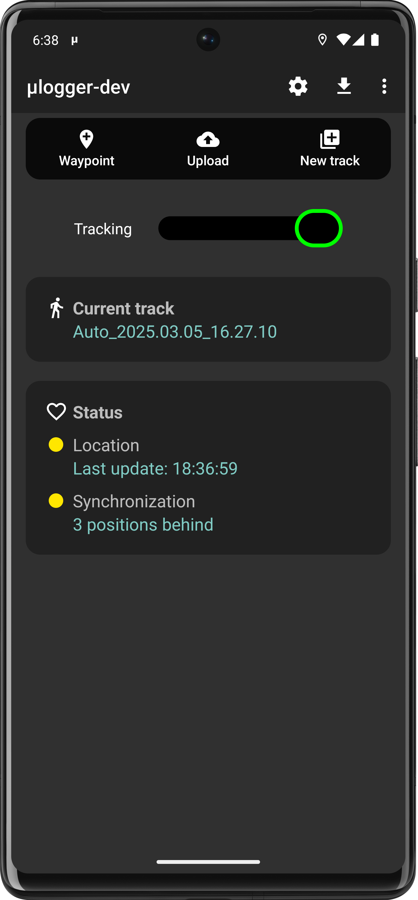
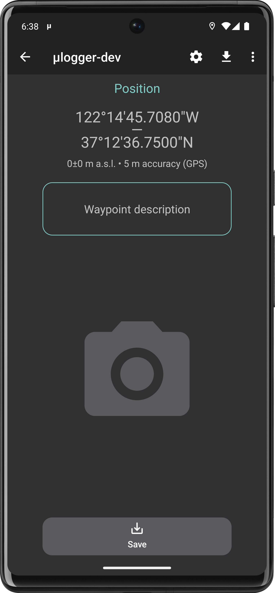
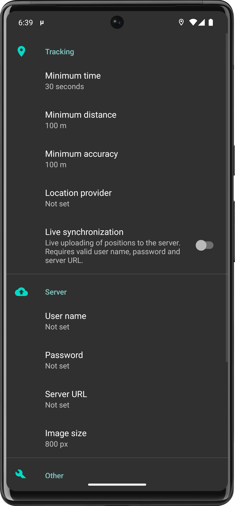
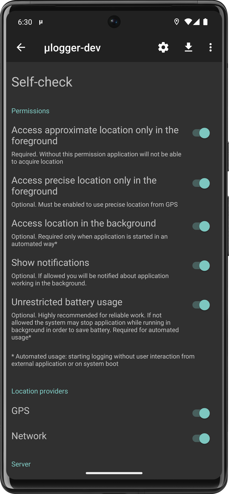

#  μlogger  

μlogger [*micro-logger*] is an android application for continuous logging of location coordinates, designed to record hiking, biking tracks and other outdoor activities. 
Application works in background. Track points are saved automatically at chosen intervals or manually and may be uploaded to dedicated server in real time.
This client works with [μlogger web server](https://github.com/bfabiszewski/ulogger-server). 
Together they make a complete self owned and controlled client–server solution.

## Download

## Features
- meant to be simple and small (*μ*)
- low memory and battery impact
- focus on privacy, doesn't use Google Play services, logs to self-owned server
- uses GPS or network based location data
- synchronizes location with web server in real time, in case of problems keeps retrying
- alternatively works in offline mode; positions may be uploaded to the servers manually
- allows adding waypoints with attached images and comments (required μlogger server version 1.0+ for synchronization)
- configurable tracking settings
- export to GPX format
- self-check screen for basic diagnostics
- automation

## Screenshots
  

## Self-check
In case of problems, you may go to Self-check menu. It will check whether all necessary permissions are granted and all settings are properly configured.

## Help
- μlogger's current status is shown by two leds, one for location tracking and one for web synchronization: 

| led                                                | tracking                        | synchronization       |
|----------------------------------------------------|---------------------------------|-----------------------|
|   | on, recently updated            | synchronized          |
|  | on, long time since last update | synchronization delay |
|     | off                             | synchronization error |

- clicking on current track's name will show track statistics

## Automating
- μlogger may accept commands from other applications for starting or stopping its operations. To make it work you must explicitly enable this functionality in app settings ("Allow external commands" switch).
- commands are sent as `broadcasts` with following `intent` parameters:
  - target package: `net.fabiszewski.ulogger`
  - target class: `net.fabiszewski.ulogger.ExternalCommandReceiver`
  - action: `net.fabiszewski.ulogger.intent.action.COMMAND`
  - extra: 
    - `command: [command name]` (string value), where command name is one of: 
      - `"start logger"` for starting position logging
      - `"start new logger"` for creating a new track and starting position logging to it 
      - `"stop logger"` for stopping position logging
      - `"start upload"` for starting track data upload to server (in case live tracking is off)
    - `overwrite: [true|false]` (boolean value), optional parameter for `start new logger` command:
      - `true` (default) to ignore not synchronized track and overwrite it with new one
      - `false` to abort if creating new track would overwrite not synchronized positions
- third party examples:
  - Automate (LlamaLab) – Send broadcast block with `Package`, `Receiver Class` and `Action` fields as above and `Extras` field eg. `{"command": "start logger"}`
  - Tasker (joaomgcd) – System → Send intent. Fields `Action`, `Package`, `Class` as above and `Extra` field eg. `command:start logger`
- command line: `am broadcast -a net.fabiszewski.ulogger.intent.action.COMMAND --es command "start new logger" --ez overwrite false net.fabiszewski.ulogger net.fabiszewski.ulogger.ExternalCommandReceiver`

## Location permissions
Starting with Android 11, if you want to use the application without user interaction (automating, autostart on boot), it is necessary to grant application background location permission ("Allow all the time" option).
In case of automation the controlling application must also have the same background location permission granted.
In all other cases, when you start tracking from app screen, it is enough to grant "Allow only while using the app" option.

## Battery optimization
For reliable work battery optimization should be turned off for µlogger. Otherwise location service working in the background may be stopped by the operating system.
On Android 12+ the application will refuse to start from background without user interaction (automation, autostart) with battery optimization turned on.

## App settings guidelines
Finding the optimized settings for your practice can be a bit complex and may require you to do a lot of testing.
As a first approach, here are some parameters that offer a good compromise between precision and the number of points acquired by your server.

| Activity           | Time       | Distance | Accuracy | Provider      |
|--------------------|------------|----------|----------|---------------|
| **hiking/cycling** | 30 seconds | 100m     | 100m     | GPS + Network |
| **motorbiking**    | 1 minute   | 500m     | 50m      | GPS + Network |

They may not be optimal, depending on your feelings, and you will have to adapt them.

## Contribute translations

## Donate
  
 `bc1qt3uwhze9x8tj6v73c587gprhufg9uur0rzxhvh`  
 `Xb6X3zwLMgc3QQDNbeYmsqSwn2pofH2vXT`  

## License
  
